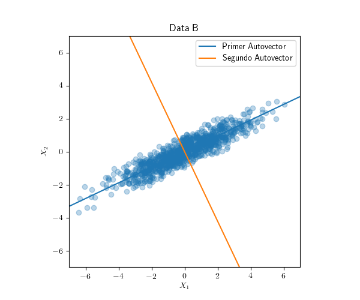

Utilizando los datos de los archivos `data_A.txt` y `data_B.txt` que se encuentran en 
https://github.com/ComputoCienciasUniandes/MetodosComputacionalesDatos/tree/master/hands_on/PCA

grafique los datos y las direcciones correspondientes al primer y segundo autovector de la matriz de covarianza.

```python
import numpy as np
import matplotlib.pyplot as plt
import numpy.linalg 

def cov_matrix(data):
    n_dim = np.shape(data)[1]
    n_points = np.shape(data)[0]
    cov = np.ones([n_dim, n_dim])
    for i in range(n_dim):
        for j in range(n_dim):
            mean_i = np.mean(data[:,i])
            mean_j = np.mean(data[:,j])
            cov[i,j] = np.sum((data[:,i]-mean_i) * (data[:,j]-mean_j)) / (n_points -1)
    return cov


dataA = np.loadtxt('data_A.txt')
covA = cov_matrix(dataA)
valsA, vecsA = numpy.linalg.eig(covA)


plt.rc('text', usetex=True)

plt.figure(figsize=(6,5))
plt.scatter(dataA[:,0], dataA[:,1], alpha=0.3)

x = np.linspace(-10,10, 10)
#primer autovector
m = vecsA[1,0]/vecsA[0,0]
plt.plot(x, m*x, label='Primer Autovector')

#segundo autovector
m = vecsA[1,1]/vecsA[0,1]
plt.plot(x, m*x, label='Segundto Autovector')

plt.axes().set_aspect('equal')
plt.xlim([-7,7])
plt.ylim([-7,7])
plt.xlabel("$X_1$")
plt.ylabel("$X_2$")
plt.title("Data A")
plt.legend()
plt.savefig('dataA_ejes.png')

dataB = np.loadtxt('data_B.txt')
covB = cov_matrix(dataB)
valsB, vecsB = numpy.linalg.eig(covB)

plt.rc('text', usetex=True)

plt.figure(figsize=(6,5))
plt.scatter(dataB[:,0], dataB[:,1], alpha=0.3)

x = np.linspace(-10,10, 10)
#primer autovector
m = vecsB[1,0]/vecsB[0,0]
plt.plot(x, m*x, label='Primer Autovector')

#segundo autovector
m = vecsB[1,1]/vecsB[0,1]
plt.plot(x, m*x, label='Segundto Autovector')

plt.axes().set_aspect('equal')
plt.xlim([-7,7])
plt.ylim([-7,7])
plt.xlabel("$X_1$")
plt.ylabel("$X_2$")
plt.title("Data B")
plt.legend()
plt.savefig('dataB_ejes.png')

```

### `data_A.txt`


### `data_B.txt`

