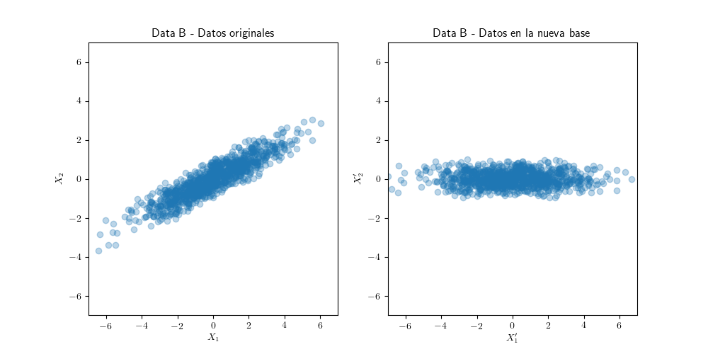
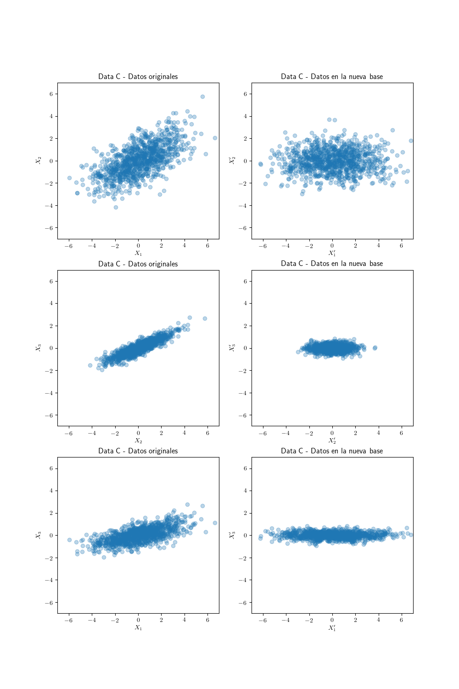

Utilizando los datos de los archivos `data_B.txt` y `data_C.txt` que se encuentran en 
https://github.com/ComputoCienciasUniandes/MetodosComputacionalesDatos/tree/master/hands_on/PCA

calcule los cambios de base de tal manera que la covarianza en la nueva base sea una matriz diagonal.


```python
import numpy as np
import matplotlib.pyplot as plt
import numpy.linalg 

def cov_matrix(data):
    n_dim = np.shape(data)[1]
    n_points = np.shape(data)[0]
    cov = np.ones([n_dim, n_dim])
    for i in range(n_dim):
        for j in range(n_dim):
            mean_i = np.mean(data[:,i])
            mean_j = np.mean(data[:,j])
            cov[i,j] = np.sum((data[:,i]-mean_i) * (data[:,j]-mean_j)) / (n_points -1)
    return cov

def new_base(data):
    cov = cov_matrix(data)
    vals, vecs = numpy.linalg.eig(cov)
    newdata = np.matmul(data, vecs)
    return newdata

# esto es lo unico necesario para cambiar de base
dataB = np.loadtxt('data_B.txt')
newdataB = new_base(dataB)

dataC = np.loadtxt('data_C.txt')
newdataC = new_base(dataC)


# todo lo demas es visualizacion
plt.rc('text', usetex=True)
plt.figure(figsize=(10,5))

plt.subplot(121)
plt.scatter(dataB[:,0], dataB[:,1], alpha=0.3)
plt.xlim([-7,7])
plt.ylim([-7,7])
plt.xlabel("$X_1$")
plt.ylabel("$X_2$")
plt.title("Data B - Datos originales")

plt.subplot(122)
plt.scatter(newdataB[:,0], newdataB[:,1], alpha=0.3)
plt.xlim([-7,7])
plt.ylim([-7,7])
plt.xlabel("$X_1^{\prime}$")
plt.ylabel("$X_2^{\prime}$")
plt.title("Data B - Datos en la nueva base")
plt.savefig('dataB.png')

plt.clf()


plt.figure(figsize=(10,15))

plt.subplot(321)
plt.scatter(dataC[:,0], dataC[:,1], alpha=0.3)
plt.xlim([-7,7])
plt.ylim([-7,7])
plt.xlabel("$X_1$")
plt.ylabel("$X_2$")
plt.title("Data C - Datos originales")

plt.subplot(322)
plt.scatter(newdataC[:,0], newdataC[:,1], alpha=0.3)
plt.xlim([-7,7])
plt.ylim([-7,7])
plt.xlabel("$X_1^{\prime}$")
plt.ylabel("$X_2^{\prime}$")
plt.title("Data C - Datos en la nueva base")


plt.subplot(323)
plt.scatter(dataC[:,1], dataC[:,2], alpha=0.3)
plt.xlim([-7,7])
plt.ylim([-7,7])
plt.xlabel("$X_2$")
plt.ylabel("$X_3$")
plt.title("Data C - Datos originales")

plt.subplot(324)
plt.scatter(newdataC[:,1], newdataC[:,2], alpha=0.3)
plt.xlim([-7,7])
plt.ylim([-7,7])
plt.xlabel("$X_2^{\prime}$")
plt.ylabel("$X_3^{\prime}$")
plt.title("Data C - Datos en la nueva base")


plt.subplot(325)
plt.scatter(dataC[:,0], dataC[:,2], alpha=0.3)
plt.xlim([-7,7])
plt.ylim([-7,7])
plt.xlabel("$X_1$")
plt.ylabel("$X_3$")
plt.title("Data C - Datos originales")

plt.subplot(326)
plt.scatter(newdataC[:,0], newdataC[:,2], alpha=0.3)
plt.xlim([-7,7])
plt.ylim([-7,7])
plt.xlabel("$X_1^{\prime}$")
plt.ylabel("$X_3^{\prime}$")
plt.title("Data C - Datos en la nueva base")

plt.savefig('dataC.png')

```



