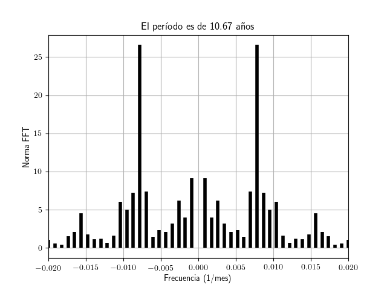

Escriba un script de python que encuentre el periodo de la variacion en manchas solares desde 1900

```python
import numpy as np
import matplotlib.pyplot as plt
import scipy.fftpack

data = np.loadtxt('monthrg.dat')

data = np.loadtxt("monthrg.dat")
fecha = data[:,0] + data[:,1]/12.0
manchas = data[:,3]
ii = fecha>1900

manchas = manchas[ii] - np.mean(manchas[ii])
fecha = fecha[ii]

n_points = len(manchas)
fft_manchas = scipy.fftpack.fft(manchas)
fft_manchas /=  n_points
frecuencias = scipy.fftpack.fftfreq(n_points, 1)
fft_norm = np.abs(fft_manchas)

ii = np.argmax(fft_norm)
periodo_year = (1/frecuencias[ii])/12.0

plt.rc('text', usetex=True)
 
plt.vlines(frecuencias, np.zeros(n_points), fft_norm, linewidth=4)
plt.title(r"El per\'iodo es de {:.2f} a\~nos".format(periodo_year))
plt.xlim([-0.02, 0.02])
plt.xlabel('Frecuencia (1/mes)')
plt.ylabel('Norma FFT')
plt.grid()
plt.savefig('fft_manchas.png')
```




