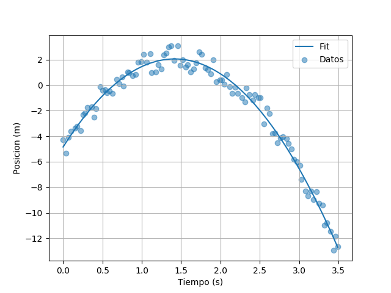

* Cree un repositorio en github que contenga tres archivos: `makefile`, `procesa.py` y `grafica.py` que al ejecutar `make` en una terminal :
  * Bajan los datos de manchas solares: `https://raw.githubusercontent.com/ComputoCienciasUniandes/MetodosComputacionalesDatos/master/hands_on/solar/monthrg.dat` 
  * `procesa.py` crea un nuevo archivo con dos columnas: fecha y numero de manchas con el nombre `fecha_manchas.dat`
  * `grafica.py` crea una grafica `fecha_manchas.pdf` a partir de los datos anteriores.

```makefile
monthrg.dat: 
	wget https://raw.githubusercontent.com/ComputoCienciasUniandes/MetodosComputacionalesDatos/master/hands_on/solar/monthrg.dat
fecha_manchas.pdf : fecha_manchas.dat grafica.py
	python grafica.py

fecha_manchas.dat : monthrg.dat procesa.py
	python procesa.py
```
python
import numpy as np
import matplotlib.pyplot as plt

data = np.loadtxt('tendencia.dat')

t = data[:,0]
y = data[:,1]
n_points = len(t)

A = np.transpose(np.array([t**2, t, np.ones(n_points)])) # ahora es 100 x 3
y = np.transpose(y) # ahora es 100 x 1

new_A = np.dot(np.transpose(A), A)
new_y = np.dot(np.transpose(A), y)
solucion = np.linalg.solve(new_A, new_y)

best_t = np.linspace(t.min(), t.max(), 100)
best_y = solucion[0] * best_t ** 2 + solucion[1] * best_t + solucion[2]


plt.scatter(t, y, alpha=0.5, label="Datos")
plt.plot(best_t, best_y, label="Fit")
plt.grid()
plt.legend()
plt.xlabel('Tiempo (s)')
plt.ylabel('Posicion (m)')
plt.savefig('fit.png')


```




