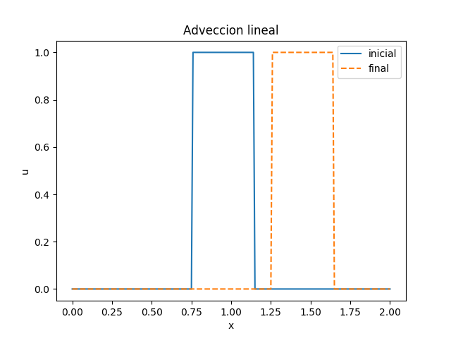

Resuelva la ecuación de advección lineal d_t u + c d_x u = 0 y la 
ecuación de advección no lineal d_t u + c d_x u = 0, usando en ambos
casos la formulación de backward difference para la derivada espacial.


# Lineal


### `makefile`
```makefile
lineal.png : lineal.txt plot_advec.py
	python plot_advec.py

lineal.txt : advec_lineal.x
	./advec_lineal.x > lineal.txt

advec_lineal.x : advec_lineal.cpp
	c++ advec_lineal.cpp -o advec_lineal.x
```

### `advec_lineal.cpp`

```c++
#include <iostream>

using namespace std;

void inicial(double *u, double min_x, double delta_x, int n);
void evoluciona(double *u_new, double *u_old, int n, double delta_x, double delta_t, double c);
void copia(double *u_new, double *u_old, int n);
void imprime(double *u, double min_x, double delta_x, int n, double t);

void inicial(double *u, double min_x, double delta_x, int n){
  int i;
  double x;
  for(i=0;i<n;i++){
    x = min_x +  i * delta_x;
    if(x<1.15 && x>0.75){
      u[i] = 1.0;
    }else{
      u[i] = 0.0;
    }
  }
}
void imprime(double *u, double min_x, double delta_x, int n, double t){
  int i;
  double x;
  for(i=0;i<n;i++){
    x = min_x +  i * delta_x;
    cout << t << " " << x << " " << u[i] << endl;
  }
}

void evoluciona(double *u_new, double *u_old, int n, double delta_x, double delta_t, double c){
  int i;
  for(i=1;i<n-1;i++){
    u_new[i] = u_old[i] - c*(delta_t/delta_x)*(u_old[i] - u_old[i-1]);
  }
}

void copia(double *u_new, double *u_old, int n){
  int i;
  for(i=0;i<n;i++){
    u_new[i] = u_old[i];
  }
}

int main(){
  double min_x=0.0, max_x=2.0, delta_x=0.01;
  int n_x = (max_x - min_x)/delta_x + 1;
  double delta_t = 0.01, T=0.5, t=0.0;
  double c=1.0;
  double * u_old, *u_new;
   
  u_old = new double[n_x];
  u_new = new double[n_x];
  
  inicial(u_old, min_x, delta_x, n_x);
  imprime(u_old, min_x, delta_x, n_x, t);
  while(t<T){
    evoluciona(u_new, u_old, n_x, delta_x, delta_t, c);
    copia(u_old, u_new, n_x);
    t += delta_t;
  }
  imprime(u_old, min_x, delta_x, n_x, t);
  return 0;
}
```

### `plot_advec.py`
```python
import numpy as np
import matplotlib.pyplot as plt

data = np.loadtxt('lineal.txt')

min_t = data[:,0].min()
max_t = data[:,0].max()

inicial_x = data[data[:,0]==min_t, 1]
inicial_u = data[data[:,0]==min_t, 2]

final_x = data[data[:,0]==max_t, 1]
final_u = data[data[:,0]==max_t, 2]

plt.plot(inicial_x, inicial_u, label='inicial')
plt.plot(final_x, final_u, '--', label='final')
plt.legend()
plt.xlabel("x")
plt.ylabel("u")
plt.title('Adveccion lineal')
plt.savefig('lineal.png')
```

### `lineal.png`




# No lineal

### `makefile`

### `advec_lineal.cpp`

### `plot_advec.py`

### `nolineal.png`


